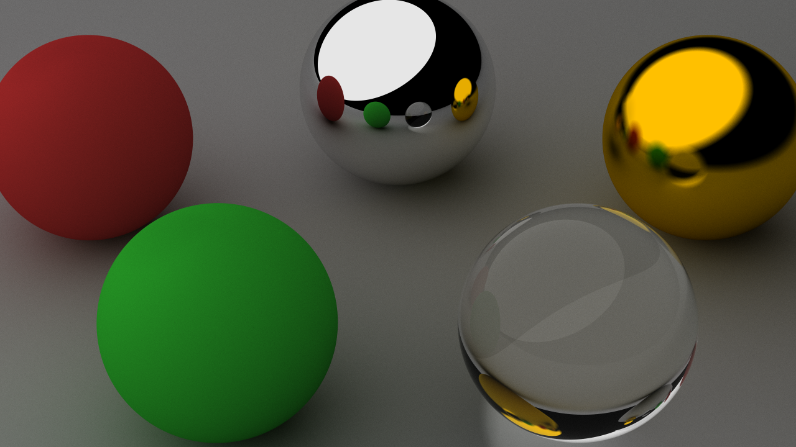
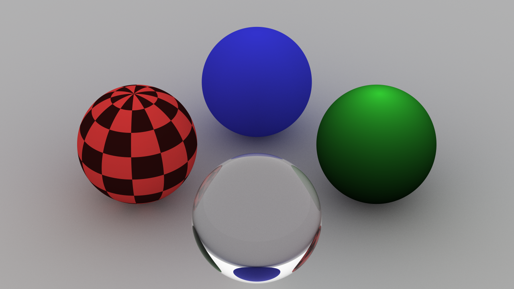
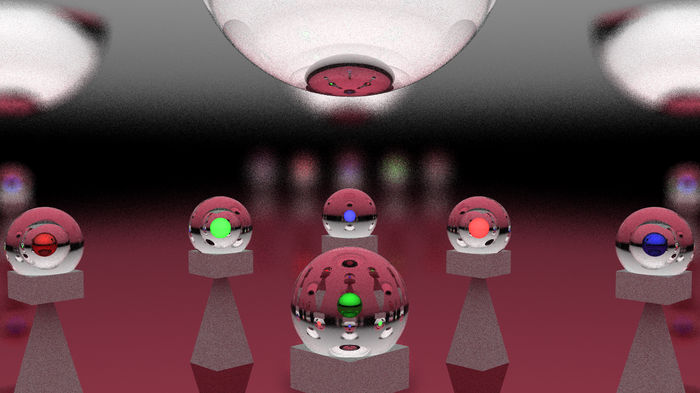

# C++ Raytracer

This project was completed as part of a Computer Graphics course, and is an implementation of a photorealistic raytracing engine built using C++ and CMake.

## Build

This raytracer is ready to build right out of the box, provided that C++17 and CMake tools are already installed. Once the folder is downloaded, use the below commands to build the executable.

```bash
.../raytracer % mkdir build
.../raytracer % cd build
.../build % cmake ..
.../build % cmake build .
```

## Instructions

Run the raytracer from the command line with an argument of a relative path to a txt file. This file contains the entire scene of objects to be rendered as well as the materials, textures, and camera settings. There are also some rendering settings available to set. This includes the thread count, ray bounce depth, and sampling count. See below for an example file.

```txt
# materials -> label name texture state color(rgb) emissive? roughness(metal only)
material mirror metal solid (0.9 0.9 0.9) false 0.0
material red diffuse solid (0.8 0.2 0.2) false
material green diffuse solid (0.2 0.8 0.2) false
material blue diffuse solid (0.2 0.2 0.8) false
material gold metal solid (1 0.75 0) false 0.1
material floor diffuse solid (0.7 0.7 0.7) false
material light diffuse solid (1 1 1) true
material glass glass solid (1 1 1) false

# objects -> shape args... material
# for sphere -> sphere center(xyz) radius material
sphere (-3 0 1) 1 red
sphere (-1.5 -3 1) 1 green
sphere (1.5 -3 1) 1 glass
sphere (0 1 1) 1 mirror
sphere (3 0 1) 1 gold
# floor
sphere (0 0 -1000) 1000 floor
# sky
sphere (-50 0 100) 100 light

# rendering
# for rays -> rays depth samples
rays 8 100
threads 8
# for camera -> camera pos(xyz) target(xyz) up-direction(norm(xyz)) fov
camera (0 -15 10) (0 0 0) (0 0 1) 25
pixels 1280 720
output renders/test.png
```

# Render Gallery

<p align="left">
    
    
    
</p>
